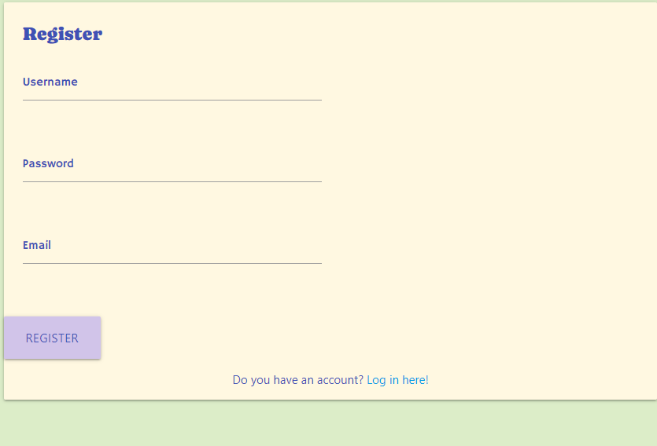
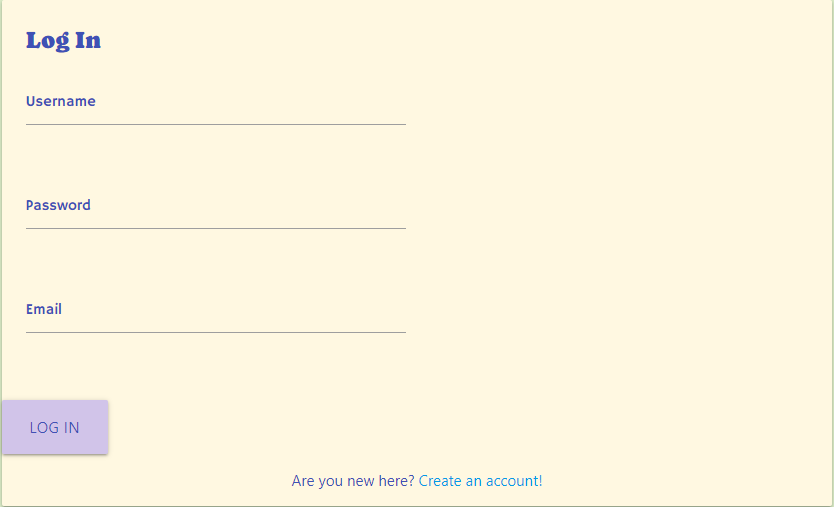
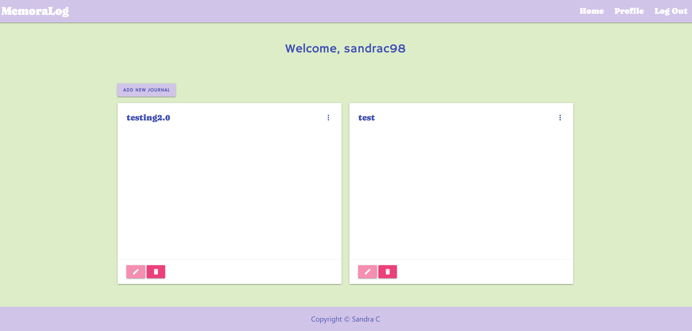
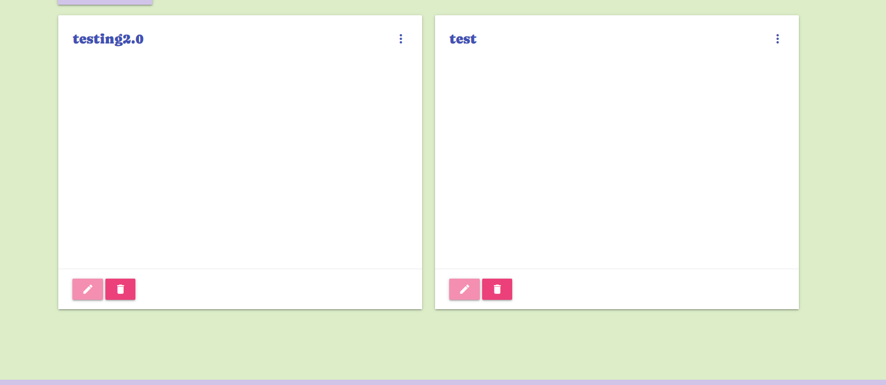
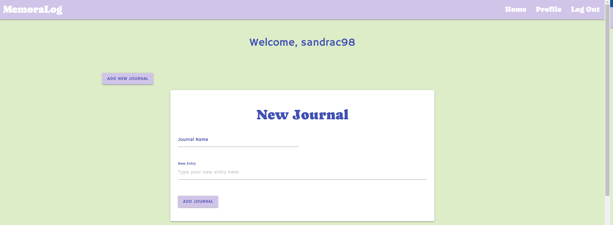
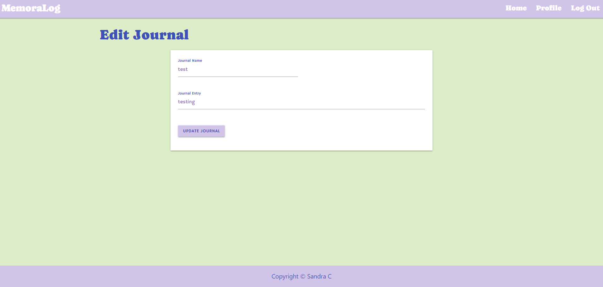
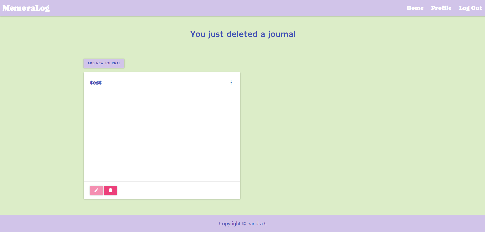
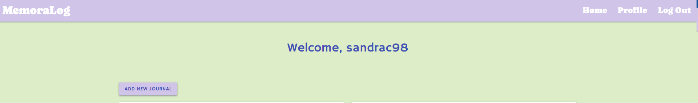
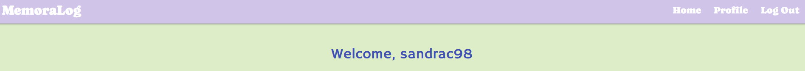

# MemoraLog

Welcome to MemoraLog, your personal journaling companion!
It's time to embark on a remarkable journey of self-discovery and personal growth. With MemoraLog, you have a powerful tool at your fingertips to capture your thoughts, emotions, and experiences. Begin your journaling adventure today and unlock the power of self-reflection. Dive into the depths of your mind, unleash your creativity, and document every step of your unique journey. So, are you ready to embark on this extraordinary journey? Start documenting your experiences, thoughts, and dreams with MemoraLog today. Let your story unfold and watch as you grow, one entry at a time.

Welcome to MemoraLog!

[View deployed site here](https://memoralog-19cc396b0aff.herokuapp.com/)

The goals of this website are:
* Facilitate self-discovery: MemoraLog aims to help users deepen their self-awareness and gain insights into their thoughts, emotions, and experiences.
* Provide a comprehensive and empowering journaling experience that supports personal growth and self-reflection
* Empower individuals to explore their inner world, uncover patterns, and discover personal growth opportunities.

# Table of Contents  

## Contents
- [UX](#ux)
  * [Ideal User](#ideal-user)
- [Features](#features)
  + [Existing Features](#existing-features)
  + [Features Left To Implement](#features-left-to-implement)
- [Design](#design)  
  + [Colour Scheme](#colour-scheme)
- [Testing](./Testing.md)
- [Deployment](#deployment)
  + [Creating a Gitpod Workspace](#creating-a-gitpod-workspace)
  + [GitHub Pages](#github-pages)
  + [Forking the GitHub Repository](#forking-the-github-repository)
  + [Making a Local Clone](#making-a-local-clone)
- [Credits](#credits)

# UX
## Ideal User
### The ideal visitor for this website is:

* Someone who values personal growth, self-reflection, and creative expression.
* Someone  who is motivated to explore their thoughts, emotions, and experiences in a meaningful way.
* Anyone who someone who seeks self-reflection as a means to understand themselves better. They are willing to dive deep into their thoughts, explore their emotions, and gain insights into their patterns and behaviors.
* The ideal user understands the value of consistency in journaling. They are committed to making journaling a regular practice, even during busy or challenging times. They recognize that the true benefits of journaling come from continuous engagement and dedication.

### User stories

1. As a user, I want to have a convenient and accessible platform to journal my thoughts and experiences on the go, so I can capture my ideas and reflections whenever inspiration strikes, whether I'm at home, at work, or on the move.

2. As a user, I want to be able to easily navigate through my journal entries  whenever I need to revisit them for reflection or inspiration.

3. As a user, I want to feel confident in the privacy and security of my journal entries, knowing that my personal thoughts and reflections are protected and accessible only to me, ensuring a safe and private space for self-expression.

4. As a user, I want to be able to seamlessly sync my journal across multiple devices, so I can access and continue my journaling experience from any device, ensuring that my thoughts and memories are always at my fingertips.

# Features 
## Existing Features
The website's navigation bar is designed with responsiveness in mind, ensuring it appears consistently on every page and remains fixed in place. It dynamically adapts its layout and appearance to suit various screen sizes and devices. On smaller screens, such as mobile devices, it transforms into a convenient hamburger menu for optimal navigation.

The primary objective of the navigation bar is to enhance the user experience by facilitating seamless movement between different sections of the website. Users can effortlessly explore various pages without having to rely solely on the back button. The navigation bar remains easily accessible and provides intuitive navigation options throughout the website.

User Registration: Users can register for an account by providing a username, password, and email.

  

User Login: Registered users can log in to their accounts using their credentials.

User Profile: Each user has a profile page that displays their information, such as the username.

- Displaying a list of existing journals:
     Each journal is represented as a card with a title and a summary.
     Clicking on a card reveals more details about the journal entry.

- Adding a new journal:
      Clicking the "Add New Journal" button reveals a form where users can enter the journal name and entry.
      Submitting the form creates a new journal entry and stores it in the database.

- Editing an existing journal:
      Clicking the "pen" button on a journal card allows users to modify the journal name and entry.
      Submitting the edit form updates the journal entry in the database.

- Deleting a journal:
     Clicking the "Delete" button on a journal card removes the journal entry from the database.

- User Authentication: The app utilizes session-based user authentication. Users need to log in to access their profile.

- Navigation Menu: The app includes a navigation menu that changes based on the user's authentication status. It displays options such as Home, Profile, New Journal, Log In, and Register.

- Flash Messages: Flash messages are used to provide feedback to users, such as successful registration, incorrect login credentials, or the need to log in to access certain features.

## Features Left to Implement

- I would like to implement the option to add categories for the journals
- I would like to incorporate the option to integrate with the calendar app for effective monitoring of future events.
- I would like to give the user the option to upload media files like pictures and videos.

# Design
## Colour Scheme.

I chose to use various shades pastel colours as they can be an excellent choice for journaling, as they often evoke a sense of calmness, tranquility, and creativity. Here are some reasons why pastel colors can be beneficial for journaling:

Soft and Soothing: Pastel colors, with their subdued tones, can create a soothing and gentle visual experience. They are less intense than bright or bold colors, making them conducive to a calm and peaceful journaling environment. Pastel hues can help create a relaxed atmosphere and promote a sense of serenity while you engage in self-reflection.

Emotional Expression: Colors can have a significant impact on our emotions and mood. Pastel colors, with their delicate and light tones, can evoke feelings of positivity, happiness, and optimism. Incorporating pastel shades into your journal can help you express and capture a range of emotions with subtlety and grace.

Versatile and Harmonious: Pastel colors are known for their versatility and compatibility with one another. They tend to harmonize well when used together, creating a visually pleasing and cohesive aesthetic.

# Deployment

## Heroku Deployment

This application can be easily deployed to Heroku using the following steps:

Create a Heroku Account: If you don't have one already, sign up for a free Heroku account.

Install Heroku CLI: Install the Heroku CLI on your local machine to interact with Heroku from the command line.

Fork this Repository: Fork this repository to your GitHub account by clicking the "Fork" button at the top-right corner of this page.

Create a New Heroku App: Log in to your Heroku account and create a new app from the Heroku dashboard. Choose a unique name for your app.

Connect GitHub Repository: In the "Deploy" tab of your Heroku app dashboard, under the "Deployment method" section, select "GitHub" as the deployment method. Connect your forked repository by searching for its name.

Configure Environment Variables: In the "Settings" tab of your Heroku app dashboard, click on the "Reveal Config Vars" button. Add any necessary environment variables used in your application.

Deploy the App: In the "Deploy" tab, manually deploy your app by clicking the "Deploy Branch" button under the "Manual deploy" section. This will deploy the latest version of your app from the main branch.

View Your App: Once the deployment is successful, click on the "Open App" button in the top-right corner of the Heroku dashboard to view your deployed app.

