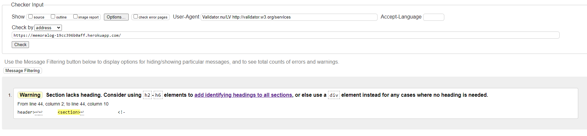
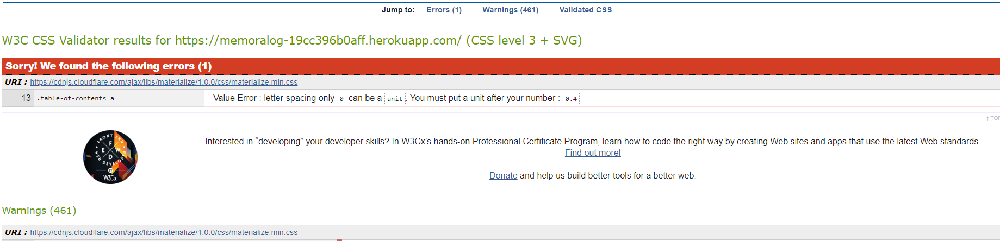
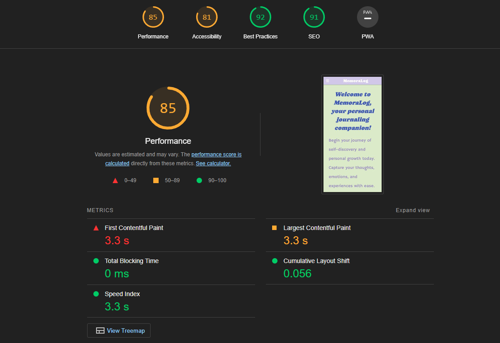
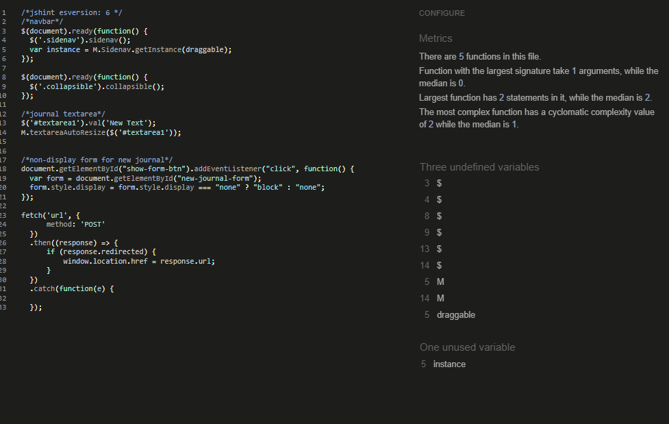

# Testing 

Memoralog was tested for responsiveness using the Google Chrome browser and the Chrome Developer Tools to check the different screen sizes. Additionally, the website was also tested on a Samsung Galaxy a52 5G using the Samsung internet browser. No errors were found during the testing process.

- [User Stories Testing](#user-stories-testing)
- [Manual Testing](#manual-testing)
- [W3C HTML Validator](#w3c-html-validator) 
- [W3C CSS Validator](#w3c-css-validator)
- [Lighthouse](#lighthouse-score)
- [JSHINT Javascript Code Quality Tool](#jshint-javascript-code-quality-tool)
- [Unfixed Bugs](#unfixed-bugs)

## User Stories Testing.
* As a user I want to be able to access my journals wherever I am.
    - This can be achieved by creating an account and use the credentials on any browser

* As a user I want to be able to create a new journal at any time.
    - This can be achieved using the form provided on the profile page.

* As a user I want to be able to edit my journals
    - This can be achieved by pressing the "pen" button located on the buttom of the journal card.

* As a user I want to be able to delete my journals
    - This can be achieved by pressing the "delete" button located on the buttom of the journal card

## Manual Testing.

|Test Label   | Test Action   | Expected Outcome   | Test Outcome   |   
|-------------|---------------|--------------------|----------------|
|Journals dissapear when loging out the page|Log Out|I can't access the journals without log in again|PASS| 
|The add new journal button creates a new journal| Press 'Add new journal' button|Form will appear and when filled out and submitted will create a new journal|PASS|   
|The delete button removes the chosen journal| Press the delete button|The journal get deleted|PASS|   
|The edit button opens the edit journal form and submit the edited journal| Press the edit button and submit an update|The button redirects to the edit journal form and when submited it succesfully update the journal|PASS|
 
# W3C HTML Validator
 - Code was checked using https://validator.w3.org/ error showed in the results have been fixed. 

 

# W3C CSS Validator
- The errors display are related to the Materialize link which is vital for the functionality of this app https://jigsaw.w3.org/css-validator/
  

# Lighthouse score. 

# JSHINT Javascript Code Quality Tool

